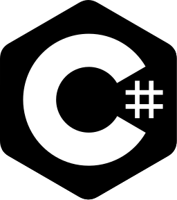

# Noble / </img> NobleIsTaken / </img> NobleHxn

- Roblox Developer since 2019
- Hobby JS programmer & tech enthusiast
- Aspiring Game Developer
- Neighborhood Furry

##### *Personal Info*

- Croatian 🇭🇷
- 21 y/o

#### Languages
##### *Real World*
- **English** (C2 / Bilingual)
- **Croatian** (Native)

##### Programming
</img> </img> </img>

###### *Lesser Knowledge*
</img> </img>

### Tools
</img> </img> </img>

### Experience
<a href="https://www.roblox.com/communities/7189408/Octa-Studios"></img></a> <a href="https://www.roblox.com/communities/15556721/Twin-Atlas"></img></a> <a href="https://www.roblox.com/communities/5819563/Stone-Haven-County-Asylum"></img></a>

###### *In Development / Personal Project*

<a href="https://www.roblox.com/communities/6360502/Supersonic-Industries"></img></a> <a href="https://nobles.network"></img></a>